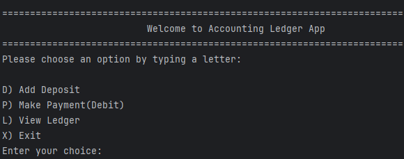
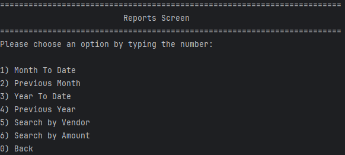
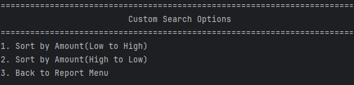

# Accounting Ledger Application

A command-line Java application that simulates a personal or small-business accounting ledger. Users can record deposits and payments, view transactions, and generate reports based on different criteria.

---

## Features

- Add deposits and payments
- View:
 - All transactions
 - Only deposits
 - Only payments
- Generate reports:
 - Month-to-date
 - Previous month
 - Year-to-date
 - Previous year
 - Search by vendor
 - Custom search by amount (low to high / high to low)
- File storage: saves all transactions to `transactions.csv`
- Input validation and formatted date/time display

---

## Screenshots

### Home Menu


### Ledger Menu


### Report Screen


### Custom Search


---

## Interesting Code Snippet

```java
public static void getCustomSearch(ArrayList<Transaction> allTransactions) {
   boolean inCustom = true;
   while (inCustom) {
       UserServices.displayCustomSearchScreen();
       int option = UserServices.getScanner().nextInt();
       UserServices.getScanner().nextLine();

       ArrayList<Transaction> sortedAmount = new ArrayList<>(allTransactions);

       switch (option) {
           case 1:
               sortedAmount.sort(Comparator.comparingDouble(Transaction::getAmount));
               for (int i = 0; i < sortedAmount.size(); i++) {
                   System.out.println(sortedAmount.get(i));
               }
               UserServices.pause();
               break;
           case 2:
               sortedAmount.sort(Comparator.comparingDouble(Transaction::getAmount).reversed());
               for (int i = 0; i < sortedAmount.size(); i++) {
                   System.out.println(sortedAmount.get(i));
               }
               UserServices.pause();
               break;
           case 3:
               System.out.println("Returning to Report Menu...");
               inCustom = false;
               break;
       }
   }
}
```

This function provides a dynamic way to filter and display transactions based on amount, using classic loops and comparators.

---

## Technologies Used

- Java
- Java Collections (ArrayList)
- LocalDate & LocalTime
- File I/O
- Git & GitHub

---

## How to Run

1. Clone this repository
2. Open it in your preferred IDE (e.g., IntelliJ, VS Code)
3. Run the `AccountingLedgerApp.java` file
4. Follow the interactive prompts

---

## Author

Created by Eyob Mengistu as a capstone Java CLI project.
